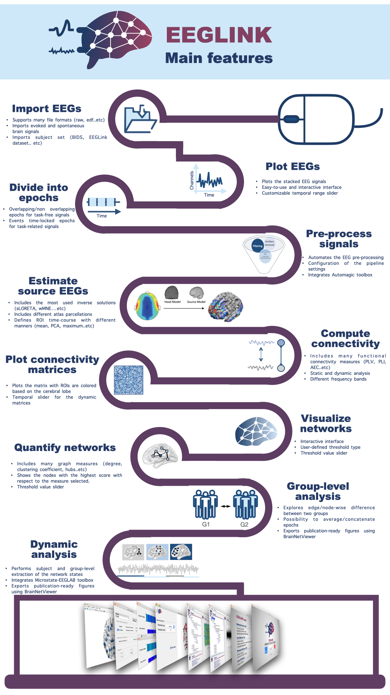

# EEGLINK: From signals to networks

An open-source software for analyzing, visualizing 
and quantifying EEG source-space NETworks
by Aya Kabbara, Mahmoud Hassan
<br>


## What is EEGLINK?

> The electroencephalography (EEG) source connectivity method is conceptually quite attractive, as high spatiotemporal resolution networks can be directly identified in the cortical-source space, provided that some methodological aspects are carefully accounted for to avoid pitfalls. However, one has to use several tools (sometimes in different programming languages) to entirely perform the EEG source connectivity, from signal to network, which limits the use of this tool by researchers/clinicians. Thus, developing an “ALL-IN-ONE” tool that permits the researchers and clinicians to easily use the EEG source connectivity will be of great interest in cognitive and clinical neuroscience. In this project, we will present the first all-in-one open-access/source tool that goes from EEG preprocessing to network characterization and quantification. EEGLink is a toolbox for Matlab dedicated to the construction, analysis and visualization of brain networks obtained from electroencephalographic signals. In practice, the inputs of the EEGLink are the EEG signals collected from healthy subjects and/or patients, during the execution of a cognitive task or during resting state. EEGLink facilitates data processing by automating the pre-processing, the reconstruction of brain sources, the calculation of functional connectivity between brain regions and the visualization of constructed static/dynamic brain networks. Three important modules are also implemented : 1) A module allowing to quantify and characterize the cerebral networks, 2) a module “group analysis” which allows to explore the differences between the cerebral networks of two groups in terms of spatial and temporal characteristics, and 3) a module “dynamic analysis” which offers the possibility to track the dynamics by extracting the main network states fluctuating over time. We believe that this tool can help researchers, neuropsychologists and the neurologists in their research to identify functional alterations associated with brain disorders such as cognitive declines in Alzheimer’s disease (AD) and Parkinson’s disease (PD) and epileptogenic zone identification. 

## Software overview

> EEGLINK is an open-source software written using Matlab. Its graphical interface is written in Java/Swing embedded in Matlab scripts. Through the graphical user interface, users could access all the software functions without any direct interaction with the Matlab environment. Thus, no programming skills are needed. 

All data examples used in this tutorial are located in 
the `data` folder.

## Main modules

EEGLink covers the basic EEG/MEG pipeline for brain network reconstruction and analysis: loading data, epoching, plotting, estimating cortical activity from sensor data, computing connectivity, illustrating the network, quantifying the network using graph theory, group analysis and dynamic analysis.
<br>


## External tools

Many EEGLink functions have external tools dependencies. The integrated tools are: 
- Automagic (Pedroni, Bahreini, and Langer 2019): This toolbox was used to conduct an automatic preprocessing. 
- Brainstorm (BS) (Tadel et al. 2011): some developed functions by the BS team were used in the source estimation step. 
- Fieldtrip (Oostenveld et al. 2011): some source estimation methods and connectivity measures were computed using fieldtrip developed functions. 
- Brain connectivity toolbox (BCT) (M. Rubinov et al. 2009): Using BCT, we have quantified the networks using graph theoretical measures (mainly strength, degree, clustering coefficient, local and global efficiency, modularity). 
- Brain NetViewer (BNV) (Xia, Wang, and He 2013): Networks can be directly visualized using BNV. 
- Network-based statistics (NBS) (Zalesky, Fornito, and Bullmore 2010): to assess the edge-wise difference between two defined groups, we have used NBS. 
- Microstate EEGLAB toolbox (Poulsen et al. 2018): This EEGLAB plug-in was used to conduct a dynamic exploration of signals by extraction of the main connectivity states.
- EEGLAB (Delorme and Makeig 2004): many pop-up functions were used to load EEG signals of different formats. We also should note that Automagic makes use of some EEGLAB functions to perform some critical steps such as the independent component analysis and the interpolation of bad channels.

## Getting the code

Kindly download the release, including all the necessary files for the project.

### Option 1: Recombine Parts

To recombine the parts into the original ZIP file, use the following command on a Unix-based system:

```sh
cat eeglink_part_* > eeglink.zip

### Option 2: Direct Download

For convenience, you can download the full release as a single ZIP file from the following link:

Download [eeglink.zip](https://drive.google.com/file/d/1KtyoIk0Uw79RsJ52FqqJBDd-eh84g3Q3/view?usp=drive_link)

## Run EEGLINK

To run EEGLINK, start Matlab and change your working directory to the root folder EEGLINK.
Then, type EEGLink in Matlab command window.

## Test EEGLINK using sample signals

signals repository can be find [here](https://drive.google.com/file/d/1r0e2iA5rWu9-O8es6iYHldIR9Q8W-acx/view?usp=drive_link)

## Manual

A detailed guide to start using EEGLINK can be found on the [wiki](https://github.com/AyaKabbara/EEGLINK/wiki) page.

## References

The EEGLINK paper is submitted now for publication in NeuroImage, and can be found as preprint in bioRxiv.

